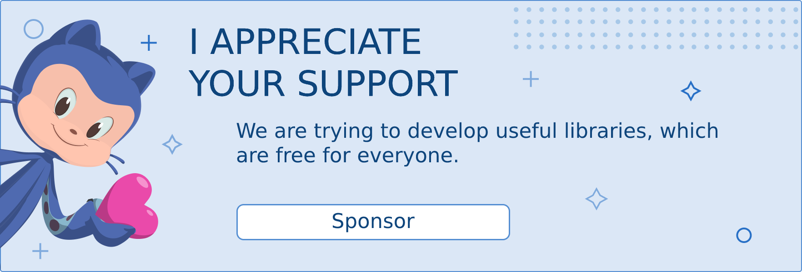

<p align="center">
  
</p>

<h1 align="center">geometric-avatar</h1>

<div align="center">

  `geometric-avatar` is a Go package that effortlessly generates captivating geometric pattern avatars based on email hashes.

  [Changelog](./CHANGELOG.md)

  [العربية](./docs/README-ar.md)

</div>

## Features
- ✅ **Simplicity & Ease**: Straightforward and effortless to use.
- 🎨 **Customizability**: Tailor avatars to your preference with a range of customization options.
- 🆙 **Golang v1.27 Compatibility**: Developed and optimized for Golang version 1.27.

## Installation

To integrate the package, utilize `go get`:

```bash
go get github.com/yourusername/geometric-avatar
```

## Usage

Below is an illustrative example of how to utilize the package in your code.

```go
package main

import (
	"fmt"
	"github.com/nawafinity/geometric-avatar"
	"image/color"
)

func main() {
	email := "geometric-avatar"
	options := map[string]interface{}{
		"size":       128.0,
		"margin":     0.08,
		"background": color.RGBA{238, 238, 238, 255},
	}

	avatar := geometric_avatar.GenerateAvatar(email, options)
	dc := avatar.Render()

	// Save the avatar as a PNG file
	err := dc.SavePNG("output.png")
	if err != nil {
		fmt.Println("Error:", err)
	}
}
```

## Sponsor
<a href="https://ko-fi.com/nawafinity" target="_blank">  
      
</a>  

## Bugs and Feature Requests

Discovered a bug or have a feature request? [Please open a new issue](https://github.com/nawafinity/geometric-avatar/issues)

## License

[MIT License](./LICENSE.md)

