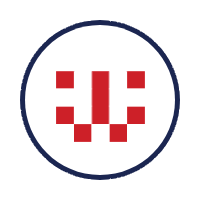
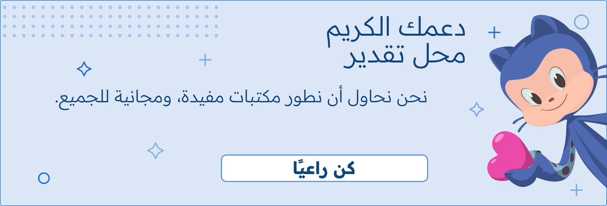

<div dir="rtl">

<p align="center">
  
</p>

<h1 align="center">صورة رمزية بطابع هندسي</h1>

<div align="center">

`geometric-avatar` هي حزمة برامج مكتوبة بلغة Go تولّد بسهولة صورًا جذّابة للملفات الشخصية بناءً على تشفير البريد الإلكتروني.

[سجل التغييرات](../CHANGELOG.md)

[English](../README.md)

</div>

## المميزات
- ✅ **البساطة والسهولة**: سهولة الاستخدام والتفاعل مع الحزمة.
- 🎨 **التخصيص**: إمكانية تخصيص الصور حسب الرغبة باستخدام مجموعة من الخيارات.
- 🆙 **توافق مع Golang v1.27**: تم تطويرها وتحسينها لتتوافق مع إصدار Golang v1.27.

## التثبيت

لتثبيت الحزمة، استخدم الأمر `go get`:

```bash
go get github.com/yourusername/geometric-avatar
```

## الاستخدام

فيما يلي مثال توضيحي حول كيفية استخدام الحزمة في الشيفرة البرمجية الخاصة بك.

<div dir="ltr">

```go
package main

import (
	"fmt"
	"github.com/nawafinity/geometric-avatar"
	"image/color"
)

func main() {
	email := "geometric-avatar"
	options := map[string]interface{}{
		"size":       128.0,
		"margin":     0.08,
		"background": color.RGBA{238, 238, 238, 255},
	}

	avatar := geometric_avatar.GenerateAvatar(email, options)
	dc := avatar.Render()

	// حفظ الصورة كملف PNG
	err := dc.SavePNG("output.png")
	if err != nil {
		fmt.Println("خطأ:", err)
	}
}
```

</div>

## الرعاة
<a href="https://ko-fi.com/nawafinity" target="_blank">  
      
</a>  

## المشاكل وطلب الميزات

هل اكتشفت مشكلة أم لديك طلب ميزة؟ [فتح طلب جديد](https://github.com/nawafinity/geometric-avatar/issues)

## الترخيص

[رخصة MIT](./LICENSE.md)


</div>